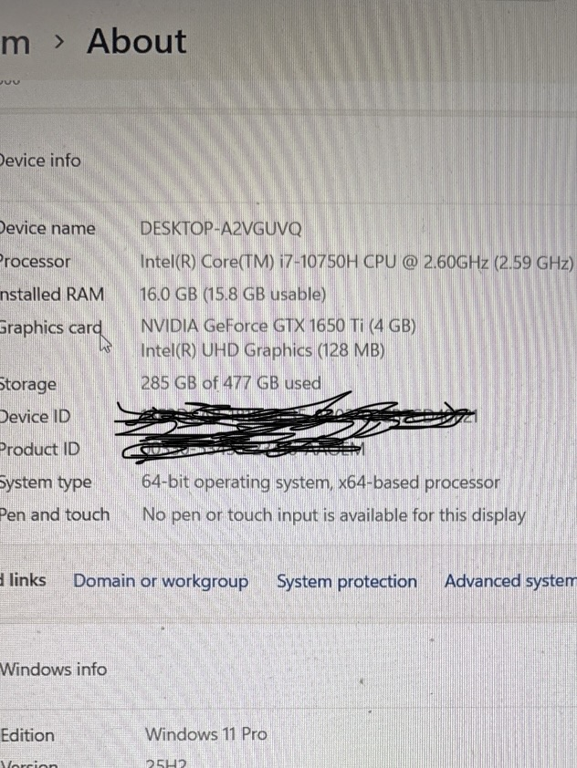
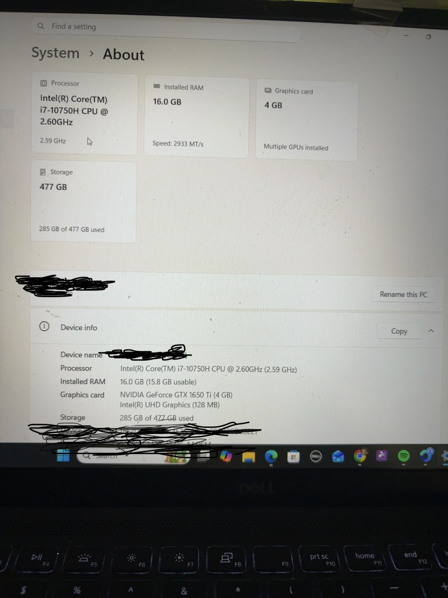
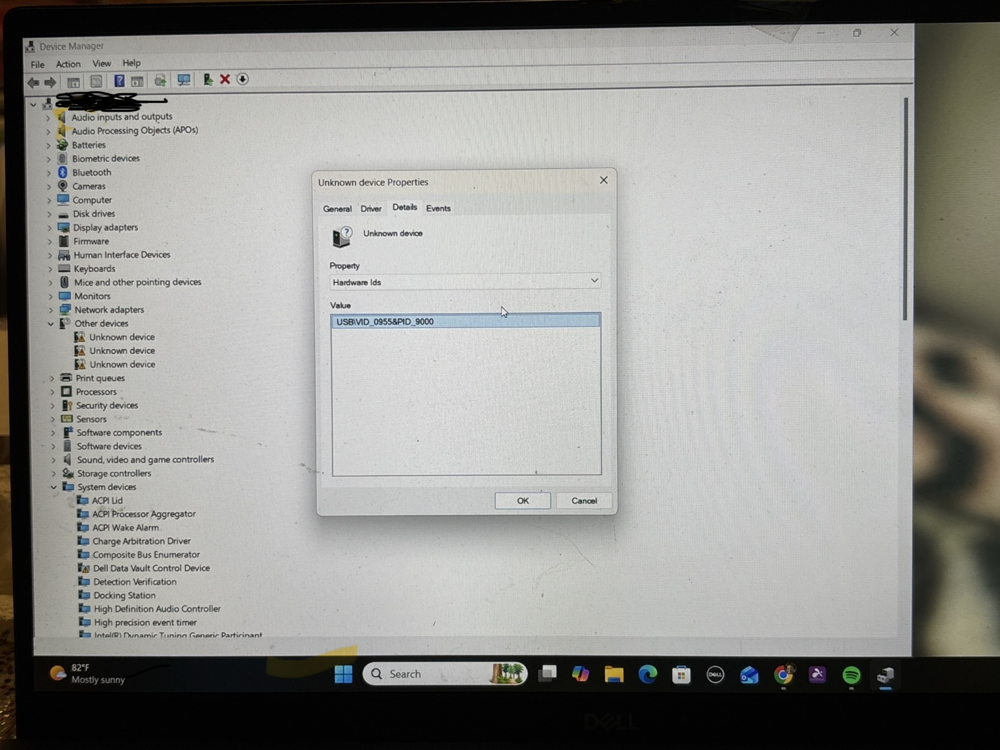
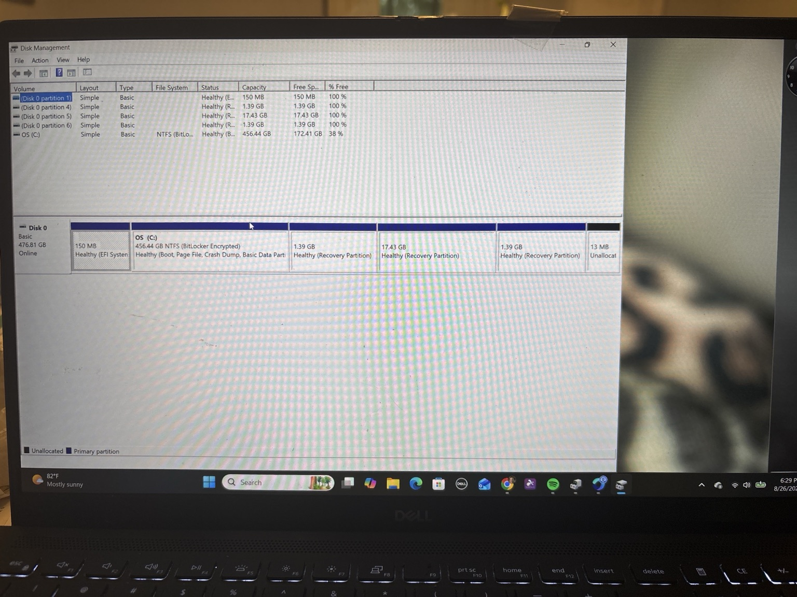
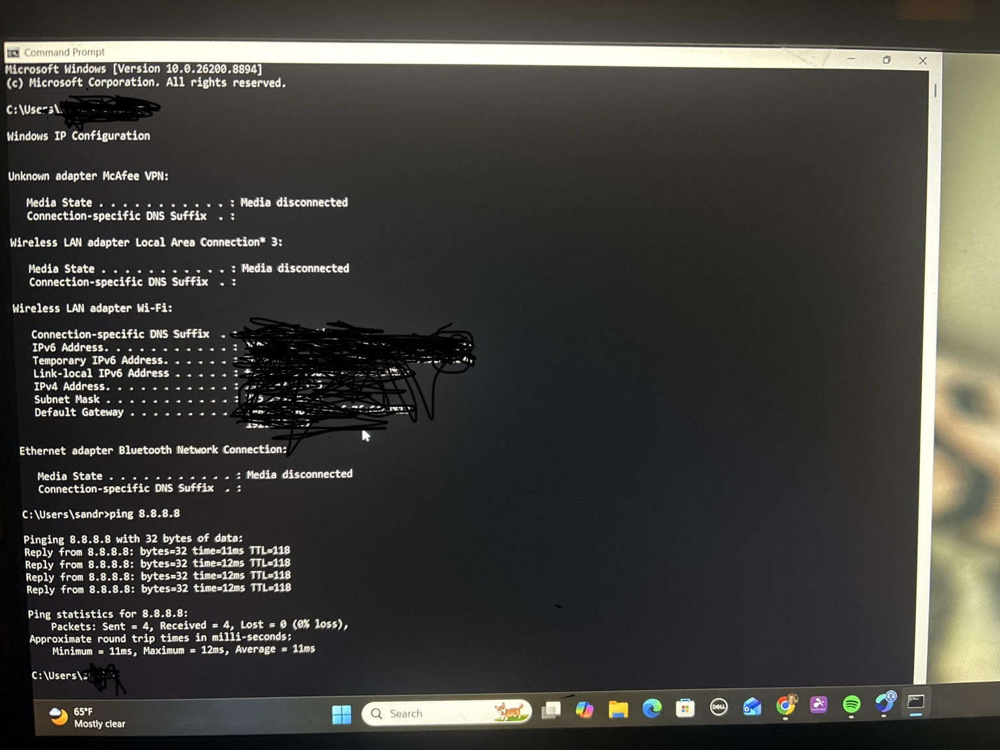

Computer Testing & Inspection Lab

This project demonstrates a basic computer testing workflow used in desktop support, computer repair, and IT refurbishment environments.

Skills Demonstrated

* Verified successful Windows boot
* Checked system specifications
* Inspected Device Manager for hardware issues
* Verified storage detection and available space
* Tested network connectivity
* Checked basic hardware functionality
* Documented test results
* Evaluated overall computer condition

Tools Used

* Windows 11
* Device Manager
* System Information
* Disk Management
* Command Prompt
* Windows Settings

Testing Process

1. Boot the computer and verify Windows starts normally.
2. Check processor, RAM, Windows version, and system type.
3. Open Device Manager and check for warning symbols or missing drivers.
4. Verify the storage drive is detected.
5. Test network connectivity.
6. Check display and basic hardware functions.
7. Record the results and determine the condition of the computer.

## System Information Check

The Windows System > About page was used to verify the computer’s hardware and operating system information.

The system was checked for:

- Processor
- Installed RAM
- Graphics hardware
- Storage capacity
- 64-bit system architecture
- Windows edition and version

The system information displayed correctly, confirming that Windows was able to identify the computer’s main hardware components.

Screenshots were added to document the system information check. 

## Device Manager Check

Device Manager was used to inspect the computer for hardware and driver issues.

During the inspection, three devices appeared under Other devices with yellow warning icons. This indicated that Windows detected the hardware but did not have the correct drivers installed.

One unknown device was investigated by opening:

Properties → Details → Hardware Ids

The hardware ID was used to help identify the device and determine that a driver issue was likely present.

This demonstrates a basic desktop support 
troubleshooting process for identifying missing or improperly installed device drivers.

## Storage / Disk Management Check

Disk Management was used to verify that the computer's storage drive was detected and functioning.

The system showed:

- One primary disk online
- Approximately 477 GB total capacity
- Windows installed on the C: partition
- NTFS file system
- Approximately 172 GB of free space
- Recovery and EFI system partitions present
- BitLocker encryption enabled

The storage drive was detected successfully and the main Windows partition appeared healthy.

## Network Connectivity Check

Command Prompt was used to verify network connectivity.

The following checks were performed:

- Confirmed the computer had an active network connection
- Verified an IPv4 address was assigned
- Verified a default gateway was present
- Tested connectivity by pinging 8.8.8.8
- Received successful replies with 0% packet loss

The results showed that the computer was connected to the network and able to communicate successfully.

A screenshot was added to document the network connectivity test.

## Basic Hardware Functionality Check

Basic hardware functions were tested to confirm that the laptop's primary input, output, and peripheral devices were working correctly.

The following checks were completed:

- Webcam tested successfully
- Keyboard tested successfully
- Touchpad movement, clicking, and scrolling verified
- Built-in audio tested successfully
- Display checked for normal operation
- USB port tested using an external mouse

All tested hardware functions operated normally.

## Final Test Results

The computer completed the inspection with the following results:

- Windows boot: PASS
- System information check: PASS
- Storage detection: PASS
- Network connectivity: PASS
- Webcam: PASS
- Keyboard: PASS
- Touchpad: PASS
- Audio: PASS
- Display: PASS
- USB port / external mouse: PASS
- Device Manager: ATTENTION NEEDED

Device Manager showed three unknown devices with driver warnings. One device was investigated using its Hardware ID, indicating that additional driver troubleshooting may be required.

Overall condition: Functional, with minor driver issues requiring further investigation.

